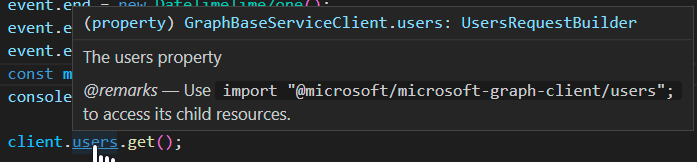

# End-to-end usage of kiota-generated API Clients in JavaScript

While working with the Kiota + JavaScript teams, it became clear that we needed more context and provide a better vision on how we should be using a kiota-generated API Client. This design document aims at providing clarity and a better understanding on how developers will be using our API Client and the underlying kiota packages.

## Status

| Date                | Version | Author           | Status |
| ------------------- | ------- | ---------------- | ------ |
| December 14th, 2022 | v0.3    | Sébastien Levert | Draft  | 
| February 15th, 2022 | v0.2    | Sébastien Levert | Draft  |
| January 17th, 2022  | v0.1    | Sébastien Levert | Draft  |

## Constraints

Before we jump into the end-to-end walk-through, it's important to set some constraints.

| Type      | Environment | Description                                                                                       |
| --------- | ----------- | ------------------------------------------------------------------------------------------------- |
| Platforms | Node        | Current and 2 Previous LTS (14 / 16 / 18)                                                         |
| Platforms | Web         | Edge, Chrome, Firefox and Safari (Latest released version + immediate previous version)           |
| Modules   | Node        | ESM2019 + CJS                                                                                     |
| Modules   | Web         | ESM2019                                                                                           |
| Types     | All         | Typings / Models should be available for both the core and the service libraries for Graph models |

## NodeJS end-to-end using the Service library

### Concept

This example is utilizing both the core and the service library. That means that as a developer, we want the full fluent API, allowing me discover APIs via the intellisence. Because the service library leverages the core library, we also want to highlight that we can leverage the core components directly (like the `.api()` method).

### Install the Microsoft Graph JavaScript Service Library

There will be two versions of the service library for the Graph JavaScript API Client. The default one will bring the representation of the v1.0 of Microsoft Graph. The second one will bring the representation of the beta of Microsoft Graph. This will be the only difference between these two libraries, as all the handcrafted code (delivering authentication, middlewares, tasks, etc.) will happen in the core library.

The Microsoft Graph JavaScript Service Library includes the following packages:

- `@microsoft/microsoft-graph-client` ([npm](https://www.npmjs.com/package/@microsoft/microsoft-graph-client)) - The service library for making fluent calls to Microsoft Graph v1.0.
- `@microsoft/microsoft-graph-client-beta` ([npm](https://www.npmjs.com/package/@microsoft/microsoft-graph-client-beta)) - The service library for making fluent calls to Microsoft Graph beta.

You can use [npm](https://www.npmjs.com) to install the Microsoft Graph JavaScript Service Library:

```shell
npm install @microsoft/microsoft-graph-client --save
npm install @microsoft/kiota-authentication-azure --save
npm install @azure/identity --save
```

### Importing the right functionalities from the Graph JavaScript Service Library

```typescript
import { Client } from "@microsoft/microsoft-graph-client";
import { User, Message, BodyType } from "@microsoft/microsoft-graph-client/models";
import { AzureIdentityAuthenticationProvider } from "@microsoft/kiota-authentication-azure";
import { DeviceCodeCredential } from "@azure/identity";
```

### Setting up the app to work with the Graph JavaScript Service Library

```typescript
const deviceCodeCredentials = new DeviceCodeCredential({
	tenantId: "b61f9af1-d6cf-4cc0-a6f6-befb38bc00ed",
	clientId: "bde251a6-0ef9-42a8-a40b-9ad9bb594b2c",
});

const scopes = ["User.Read", "Mail.Send"];

const graphClient = Client.init({
	authenticationTokenProvider: new AzureIdentityAuthenticationProvider(deviceCodeCredentials, scopes),
});
```

### Calling Microsoft Graph via the Graph JavaScript Service Library

The core value of the Microsoft Graph JavaScript Service Library is the availability of the chained request builder pattern (fluent API). This provides developers with typechecking and discoverability when building on Microsoft Graph. This would highlight the full spectrum of capabilities on Microsoft Graph directly in the API Client.

Models are also available in this package and should reflect the underlying version of Graph we are targeting. Developers using our types should do it in a way that will be familiar to how they are used to with other API Clients and APIs. We should provide an easy-to-use model that feels natural in the JavaScript world. This means we should not be forcing developers to use Classes and / or other structures that will make their code less natural to them.

Because of the richness of the Graph APIs, we are making a decision to require developers to selectively import the areas of Graph they care about. This will provide a lightweight bundle size while still offering a good developer experience.

### Selective Imports of the Graph areas needed

To offer a bundle size that fair to the developer, we are using a selective imports strategy. This strategy enables developers to bring only the endpoints they need from Graph. Developers would only see the root paths of Graph when using the API Client by default, and would need to import additional path with selective imports.

#### Using the service library without any selective imports

> ❌ **Fails** <br />
> This example does not work because `usersById().directReports` is not available at the root of the Graph Client

```typescript
const directReports = await graphClient.usersById("ab677c1b-50c6-4013-aa9f-792ed42c59c8").directReports.get();
```

> ✅ **Succeeds** <br />
> This example succeeds because `me` is at the root of the Graph Client

```typescript
const me = await graphClient.me.get();
```
> ✅ **Succeeds** <br />
> This example succeeds because `users` is at the root of the Graph Client

```typescript
const users = await graphClient.users.get();
```

#### Using the service library with selective imports

> ❌ **Fails** <br />
> This example fails because `@microsoft/microsoft-graph-client/users/item` is not imported and therefore not available on the Graph Client

```typescript
import "@microsoft/microsoft-graph-client/users";
const directReports = await graphClient.usersById("ab677c1b-50c6-4013-aa9f-792ed42c59c8").directReports.get();
```

> ✅ **Succeeds** <br />
> This example succeeds because `/users/item` is imported, making it available on the Graph Client

```typescript
import "@microsoft/microsoft-graph-client/users/item";
const directReports = await graphClient.usersById("ab677c1b-50c6-4013-aa9f-792ed42c59c8").directReports.get();
const extensions = await graphClient.usersById("ab677c1b-50c6-4013-aa9f-792ed42c59c8").extensions.get();
const extensions = await graphClient.usersById("ab677c1b-50c6-4013-aa9f-792ed42c59c8").extensionsById("85147e97-ed89-4799-b5b8-8d35a9204604").get();
const joinedTeams = await graphClient.me.joinedTeams.get();
```

> ✅ **Succeeds** <br />
> This example succeeds because `/users` is imported, making it available at the root of the Graph Client

```typescript
import "@microsoft/microsoft-graph-client/me";
import "@microsoft/microsoft-graph-client/me/joinedTeams";
const joinedTeams = await graphClient.me.joinedTeams.get();
```

> ✅ **Succeeds** <br />
> This example succeeds because `/me` is imported, making it available at the root of the Graph Client

```typescript
import "@microsoft/microsoft-graph-client/me/insights";
const trending = await graphClient.me.insights.trending.get();
```

#### In-Context Help

To provide as much context as possible, all modules that are augmented should provide remarks on how to obtain the child resources they contain. This would be added as part of the attached comment block and visible in the developers IDEs.



### Use Request Configuration

Using request configuration allows developers to personalize their requests with different configuration options. The following snippets demonstrate how developers should be using the API Client.

```typescript
// Specifying only Query Parameters
const users = await graphClient.users.get({
	queryParameters: {
		count: true
	}	
});
```

```typescript
// Specifying Query Parameters and Headers
const users = await graphClient.users.get({
	queryParameters: {
		count: true,
		filter: "endsWith(mail, 'microsoft.com')",
		orderby: "displayName",
		select: "id,displayName,email",
		search: 'displayName:room'
	},
	headers: {
		ConsistencyLevel: "Eventual"
	}
});
```

```typescript 
// Specifying Middleware Options
graphClient.usersById("ab677c1b-50c6-4013-aa9f-792ed42c59c8").patch({ 
	displayName: "Megan Bowen" 
}, {
	options: [
        new RetryHandlerOptions({ maxRetries: 10 })
	]
});
```